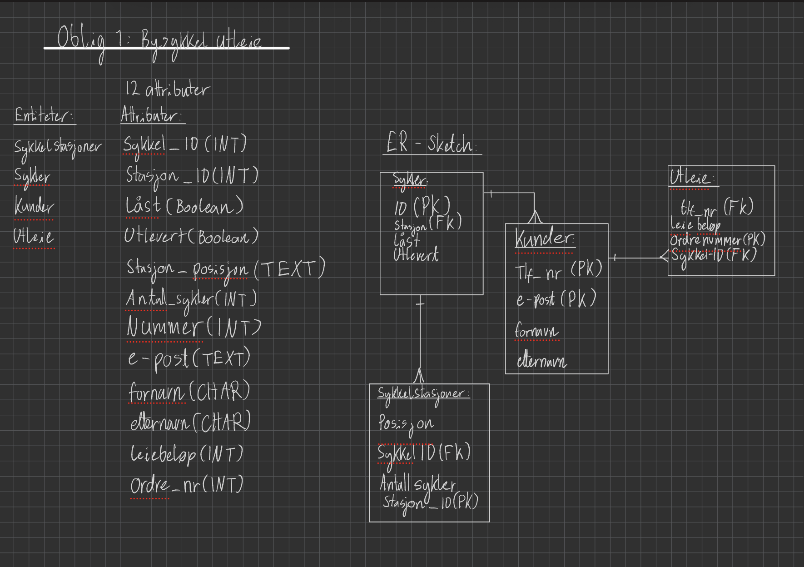
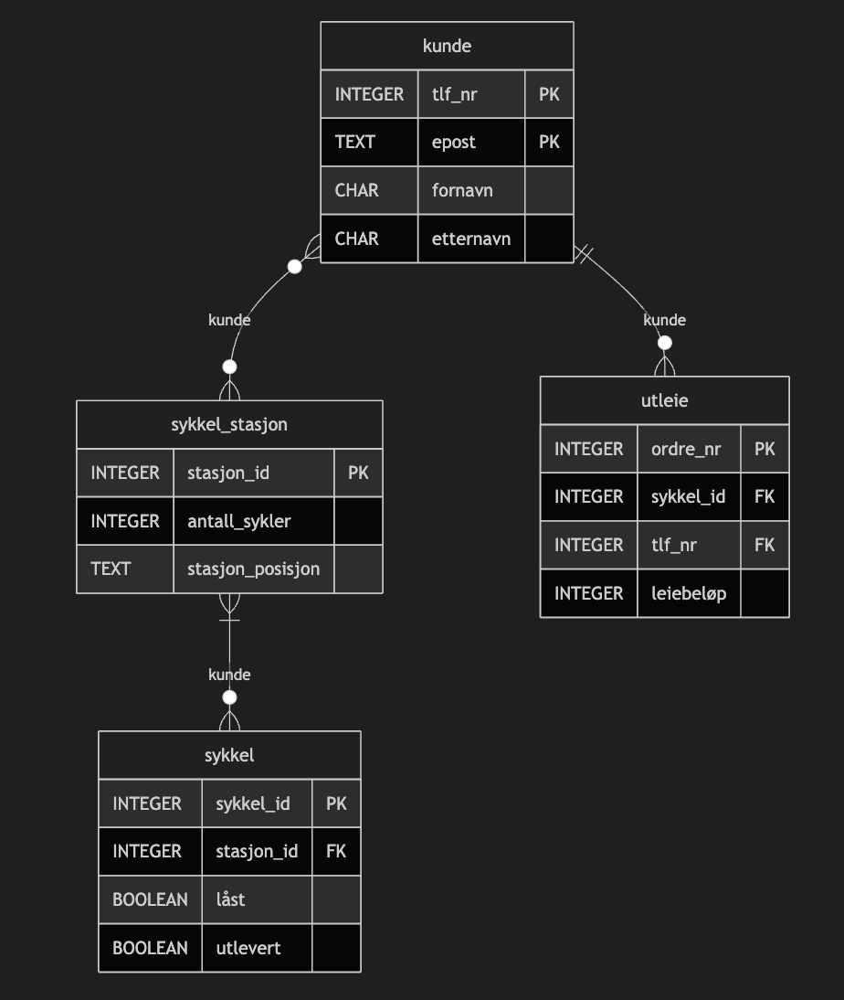
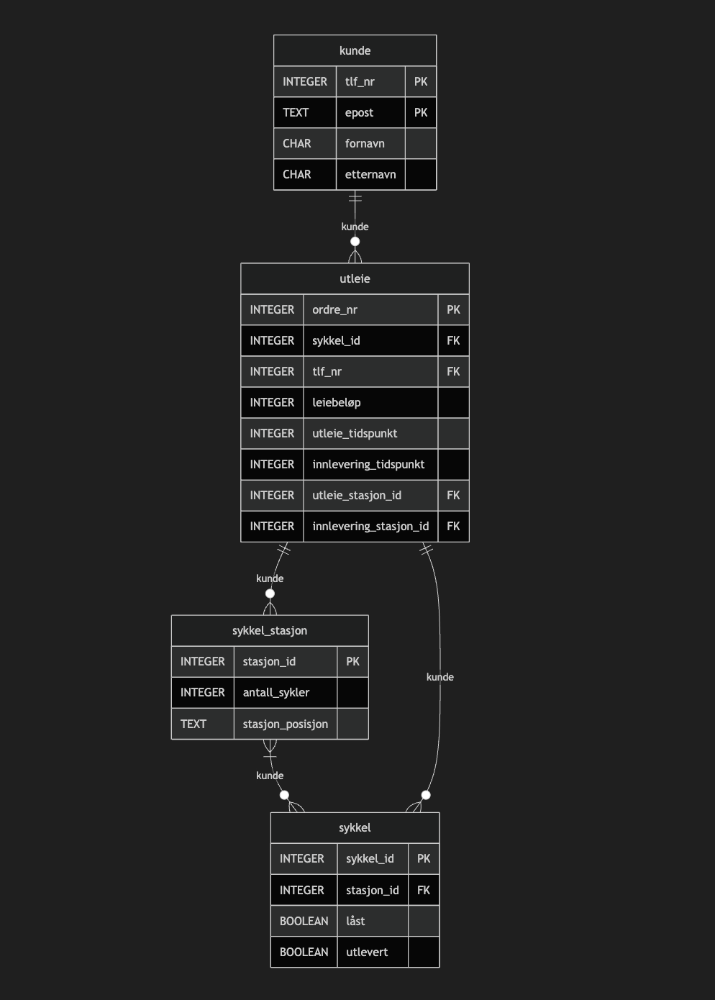
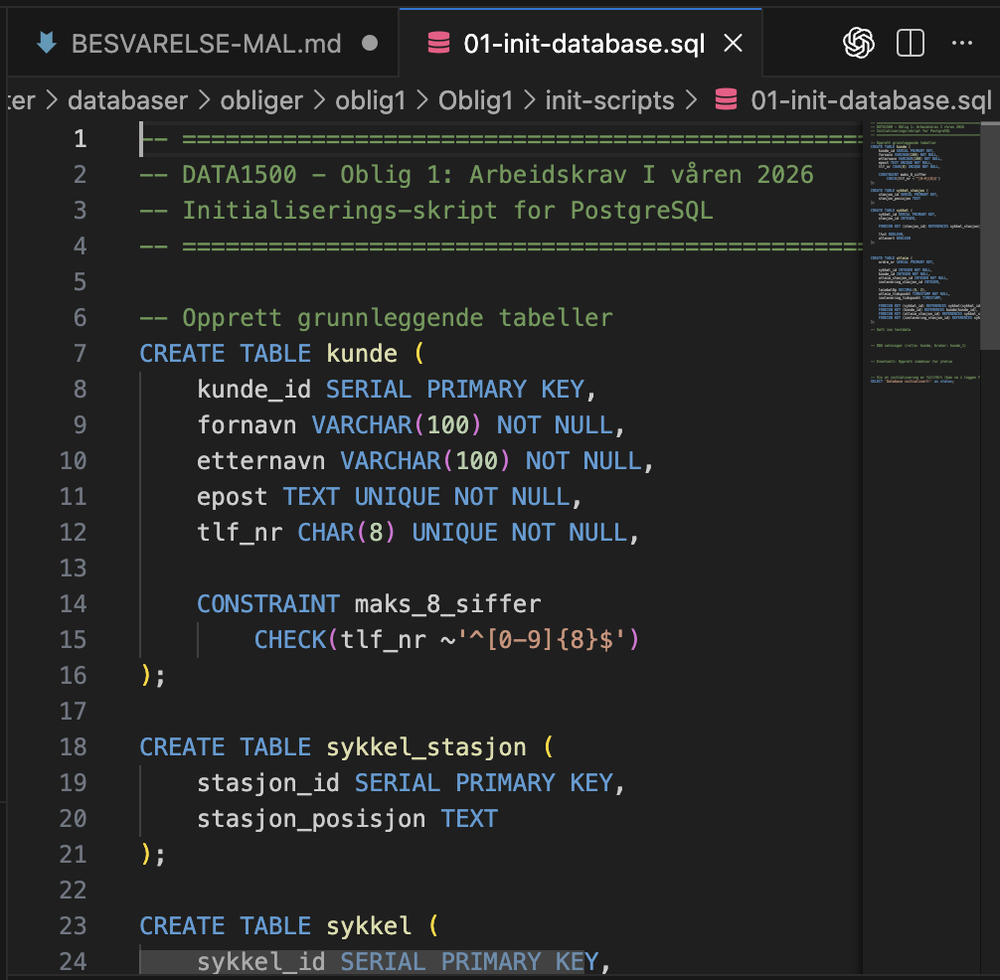
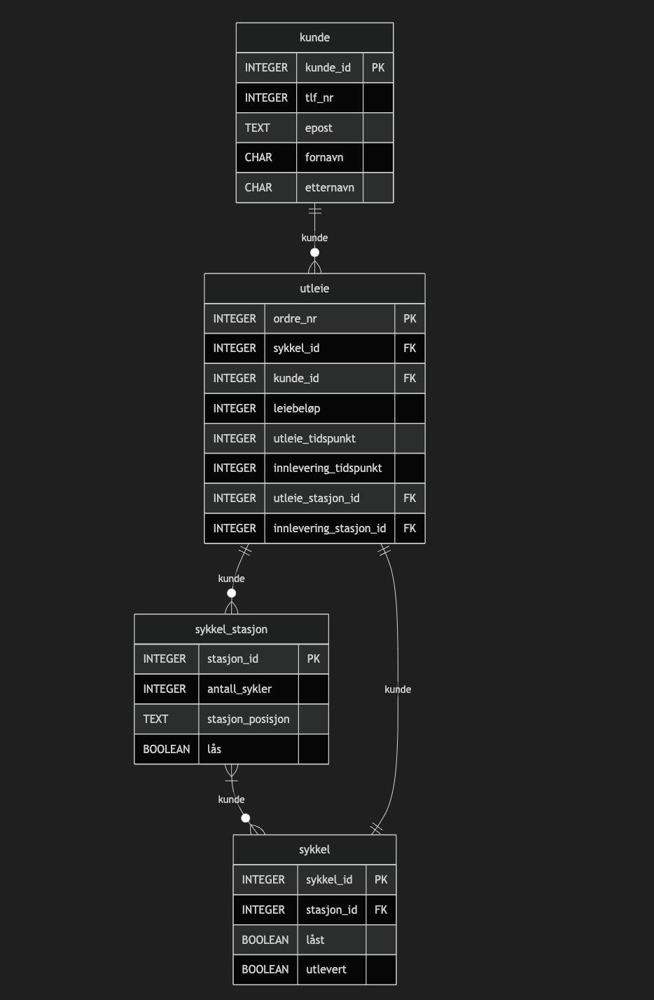
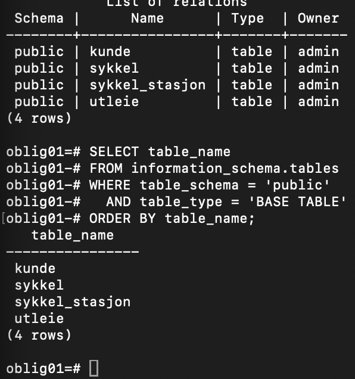
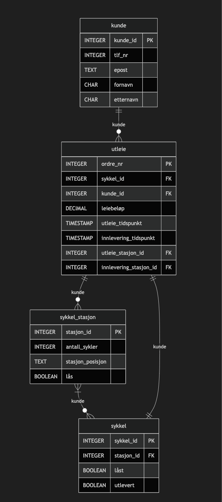
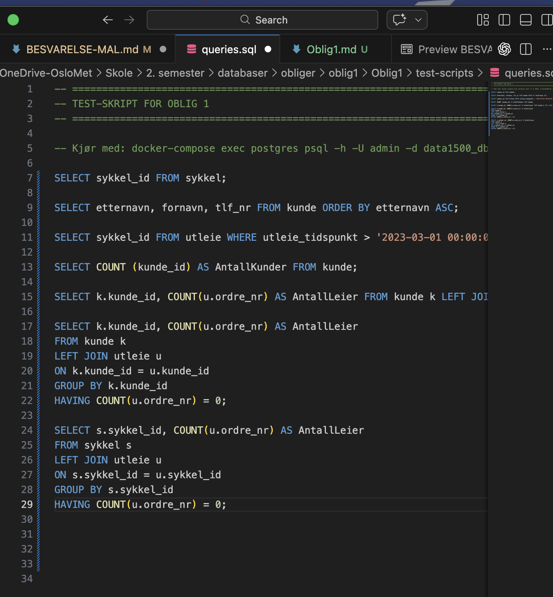

# Besvarelse - Refleksjon og Analyse

**Student:** Ellay Bryan Beckstrøm

**Studentnummer:** 407891

**Dato:** [1. Mars. 2026]

---

## Del 1: Datamodellering

for å kunne løse oppgaven så har jeg brukt boken til alt av struktur og oppgaveløsning. Det er noen få spesielle tilfeller hvor jeg ikke finner finner syntaks i boken der jeg har spurt KI(chatgpt). Jeg skriver ned alle gangen jeg spør chatgpt gjennom besvarelsen. 

Gjennom å løse hver oppgave så legger jeg merke til at databasen min hele tiden utvikles, så i noen oppgaver har jeg gått tilbake for å kunne få mest uttelling med tanke på rubrikkene. derfor kan det være litt unormal struktur noen steder.

### Oppgave 1.1: Entiteter og attributter

**Identifiserte entiteter:**

De entitetene jeg identifiserte var:

Sykkelstasjoner

Sykler

Kunder

Utleie

**Attributter for hver entitet:**

De attributene jeg mener er relevante for entitetene er:

Sykler:

sykkel_id(PK)

sykkelstasjon(FK)

låst

utlevert

Kunder:

tlf_nr(PK)

e-post(PK)

fornavn

etternavn

Utleie:

tlf_nr(FK)

leiebeløp

ordrenummer(PK)

sykkel_id(FK)

Sykkelstasjoner:

posisjon

stasjon_id

sykkel_id(FK)

antall_sykler

Liten begrunnelse for valgene mine:
Jeg har valgt at hver av entitene trenger en egen primærnøkkel basert på oppgave beskrivelsen, og at det blir lettere for meg å lage spesifike relasjoner mellom dem. Liten beskrivelse av hvordan jeg har tenkt med attributene er at en kunde kan sjekke sykkelstasjon for hvor mange sykler som er ledige og da kan åpne eventuelle sykler som står der. Sykkelstasjonen trenger derfor å vite hvilke sykler som står der og hvor mange slik at den kan låse opp sykler som tilhører stasjonen. Sykler som tilhører stasjonen som er låst blir da låst opp og utlevert. Kunden får da ett leiebeløp og hvert utleie blir da regnet som en egen "ordre". Grunn til at jeg har både låst og utlevert er siden sykler kan være ikke-låst til en stasjon men heller ikke utlevert.

---

### Oppgave 1.2: Datatyper og `CHECK`-constraints

**Valgte datatyper og begrunnelser:**

sykkel_ID(INTEGER)

stasjon_ID(INTEGER)

låst(BOOLEAN)

utlevert(BOOLEAN)

stasjon_posisjon(TEXT)

antall_sykler(INTEGER)

tlf_nr(TEXT)

e-post(TEXT)

fornavn(TEXT)

etternavn(TEXT)

leiebeløp_kr(SMALLINT)

ordre_nr(INTEGER)

Jeg mener det er best å bruke INTEGER i steden for BIGINT eller SMALLINT siden jeg mener ikke at ordre nr og de forskjellige id-ene kommer til å bli større enn 9 siffer. Leiebeløp bruker jeg SMALLINT siden jeg planlegger å legge en check constraint hvor brukeren ikke kan bruke mer enn 2000 kr om gangen. Siden vi bruker pSQL så bruker jeg TEXT på tekststrenger som kan ha vilkårlige lengder. Tlf_nr bruker jeg tekst til på grunn av constrainten som jeg lager i neste deloppgave

**`CHECK`-constraints:**

CHECK - constraints jeg mener kan være smart å ha er:

CONSTRAINT prisregel

  CHECK(leiebeløp > 0 AND leiebeløp < 2000)

Setter en grense på at beløpet ikke kan gå over 2000 kr om gangen slik
at kunder ikke kan misbruke tjenesten ved å bruke en sykkel og ikke betale.

CONSTRAINT vanlig_nummer_8_siffer

  CHECK(tlf_nr ~'[0-9]{8}$')

Setter en constraint slik at kunder ikke skriver inn "ulovlige" telefon-nr slik at det kan bli feil i databasen.

CONSTRAINT lås_sjekk

  CHECK(låst IN ('J', 'N'))

Setter at lås bare skal sjekke at den oppdateres mellom en av de to verdiene gjør det samme for utlevert attributen.

CONSTRAINT sykkel_mengde

    CHECK(antall sykler < 0)

Veldig vanlig at det ikke er mindre enn 0 sykler.


CONSTRAINT utlevert_sjekk

  CHECK(utlevert IN ('J', 'N'))

Tar litt utgangspunkt i reglene som står i boken på kapittel 3.2.8.
Spurte chatgpt om syntaks for check syntaks på vanlig nr.


**ER-diagram:**
Jeg tegnet først ett ER-diagram for hånd og så skrev jeg det inn i mermaid preview. Det var noen få syntakser jeg ikke hadde kontroll på i mermaid så jeg spurte chatgpt om hjelp med disse.
diagrammet jeg laget forhånd er veldig simpelt. 

mermaid bildet er mer utviklet siden jeg så at det var noen relasjoner som ikke ga helt mening i tegningen.

ER-diagram for hånd:



ER-diagram mermaid:



---

### Oppgave 1.3: Primærnøkler

**Valgte primærnøkler og begrunnelser:**

De primærnøklene jeg har valgt er:

Kunde:

tlf_nr

e-post

Sykkel:

sykkel_id

Sykkelstasjon:

stasjon_id

Utleie:

ordre_nr

grunnen til at jeg har valgt å ha en primærnøkkel på alle entitetene er siden det da vil bli lettere å generere og hente data fra databasen. Jeg har valgt kunde og sykkel primærnøkler ut ifra oppgaveteksten. Primærnøkkelen for utleie valgte jeg siden det kommer til å være relevant å hente forskjellige sykkelturer og informasjonen rundt disse.
Jeg vurderte å bruke posisjon som primærnøkkel for sykkelstasjon, men så tenkte jeg at du kan ha flere sykkelstasjoner i ett område, så da var det bedre å bruke en egen id for hver stasjon.

**Naturlige vs. surrogatnøkler:**

Naturlignøkkel:

e-post

tlf_nr

Surrogatnøkkel:

sykkel_id

stasjon_id

ordre_nr

Jeg har brukt både naturlige og surrogatnøkler. Jeg valgte å bruke naturlige nøkler på Kunde siden hver eneste kunde naturligvis vil ha ett eget tlf nr og epost adresse. På sykkelstasjon vurderte jeg å bruke posisjon som naturlig nøkkel, men lot være siden man kan ha flere stasjoner på samme område. Så da valgte jeg heller å bruke surrogatnøkkel for stasjonene, syklene, og utleiene.


**Oppdatert ER-diagram:**

Jeg valgte fremmed og primærnøkler før jeg kom til denne oppgaven så ER-diagrammet er enda det samme.

ER-diagram mermaid:


---

### Oppgave 1.4: Forhold og fremmednøkler

**Identifiserte forhold og kardinalitet:**
Ved å skrive ned kardinaliteten og forholdet mellom de forskellige enitetene, så kom jeg frem til at det var dårlig strukturert og ved å lese igjennom oppgaveteksten oppdaterte jeg ER-diagrammet og de tidligere oppgavene med nye entiteter og kardinaliteter.

Kardinaliteten og forholdene jeg kom frem til var:

en kunde kan ha 0 eller flere ordre(utleie). En ordre må ha nøyaktig 1 sykkel 1 kunde og 2 stasjoner(1 eller flere). Stasjoner kan ha flere sykler eller 0. Sykler kan ha 0 eller 1 stasjon.

Jeg koblet deretter alle entitetene opp mot utleie slik at kunde kan starte utleie, da henter utleie stasjon som har mer enn 1 sykkel, sykkel blir da ulåst og tilhører ingen stasjon. Kunde leverer sykkel til ny eller samme stasjon og får utleiebeløp.


**Fremmednøkler:**

Utleie samler fremmednøkler som tlf_nr, sykkel_id, sykkel_stasjon slik at hele "turen" kan bli lagret på ett ordre_nr. Sykkel trenger fremmednøkkelen sykkel_stasjon, slik at vi kan vite om en sykkel er utleid, eller hvilken stasjon den befinner seg ved.

**Oppdatert ER-diagram:**



---

### Oppgave 1.5: Normalisering

**Vurdering av 1. normalform (1NF):**

Ved å gjøre en analyse av modellen min så mener jeg at den tilfredsstiller 1 normalform. Jeg mener den tilfredsstiller 1 normalform siden den inneholder atomære verdier. Det er ingen rader som inneholder unødvendig informasjon som kunne vært delt opp over flere tabeller.

**Vurdering av 2. normalform (2NF):**

Datamodellen min tilfredsstilte ikke 2 normalform siden jeg brukte både tlf_nr og epost som primærnøkkel for kunde. Det som skjer er at resten av attributene i entiteten kunde blir avhengige av to nøkler selv om de kun skal være avhengige av 1. Jeg la derfor inn en kunstig nøkkel kunde_id som en ny primærnøkkel. Da hadde jeg ingen 


**Vurdering av 3. normalform (3NF):**

Databasen er nesten på 3 normalform, men eneste jeg la merke til var at antall_sykler egentlig ikke trenger en attribute siden den er avhengig av en annen tabell. Da fjernet jeg denne, og siden det ikke er noen transitive eller funksjonelle avhengigheter så er den nå på 3 normalform.
**Eventuelle justeringer:**

for å få modellen min på 3 normalform så oppsto problemene mine kun på 2 og 3 normalform.

For å få den til å tilfredsstille 2 normalform så laget jeg en kunstig nøkkel for kunde slik at epost og tlf_nr ikke er primærnøkler. 

For å få den til å tilfredsstille 3 normalform så fjernet jeg attributen "antall_sykler" siden den er avhengig av annen informasjon og tabeller.

---

## Del 2: Database-implementering

### Oppgave 2.1: SQL-skript for database-initialisering

**Plassering av SQL-skript:**

har laget SQL-databasen i 01-init-skript.sql,
spurte KI om hjelp til å generere test data for databasen.



[Bekreft at du har lagt SQL-skriptet i `init-scripts/01-init-database.sql`]

**Antall testdata:**
Bruker generate_series() til å lage så mange rader jeg ønsker automatisk. Bruker random(), for å få varierende data. Men ble nødt til å endre på koden min siden jeg ikke hadde låser i hver stasjon. Da fant jeg ut at jeg kan bruke "CREATE TABLE IF NOT EXISTS" til å lage kolonne for lås og generere data for disse. oppdaterte ER-diagrammet mitt med lås i sykkel_stasjon.



lagde test dataen basert på oppgaven
- Kunder: [5]
- Sykler: [100, 20 per stasjon]
- Sykkelstasjoner: [5]
- Låser: [100, 20 per stasjon]
- Utleier: [50]

---

### Oppgave 2.2: Kjøre initialiseringsskriptet

**Dokumentasjon av vellykket kjøring:**

Gjennom øving på sql så har port 5432 på macen min blitt opptatt, og jeg får ikke til å bruke den, jeg initialiserte skriptet på port 5433 heller.

Brukte docker compose up -d og
koblet til databasen med docker exec -it data1500-postgres psql -U admin -d oblig01


**Spørring mot systemkatalogen:**

```sql
SELECT table_name 
FROM information_schema.tables 
WHERE table_schema = 'public' 
  AND table_type = 'BASE TABLE'
ORDER BY table_name;
```

**Resultat:**
la inn spørringen i databasen og fikk tabellene under.



```
tabellene som ble opprettet er alle entitene fra ER-diagrammet mitt:
kunde
sykkel
sykkel_stasjon
utleie

```

---

## Del 3: Tilgangskontroll

### Oppgave 3.1: Roller og brukere

**SQL for å opprette rolle:**
Lager rollen kunde, ved CREATE ROLE.
```sql
CREATE ROLE kunde;
```

**SQL for å opprette bruker:**
Bruker CREATE USER til å opprette kunde_1
```sql
CREATE USER kunde_1;
```

**SQL for å tildele rettigheter:**
Slik jeg har laget ER-diagrammet så vil jeg at hele ordren skal kunne styres igjennom utleie, men kunde må ha tilgang til å se hvor mange sykler som er parkert på en stasjon. 
Jeg mener derfor at kunden skal ha tilgang til å lese utleie og sykkel stasjoner.
Siden jeg skal gi tilgang til å lese utleie i neste del-oppgave velger jeg å gi tilgang til kun sykkel_stasjon for nå.

```sql
GRANT kunde TO kunde_1;

GRANT USAGE ON SCHEMA public TO kunde;

GRANT SELECT ON sykkel_stasjon TO kunde;
```

---

### Oppgave 3.2: Begrenset visning for kunder

**SQL for VIEW:**

```sql
CREATE VIEW utleier (ordre_nr, utleid, innlevert, beløp) AS

SELECT ordre_nr, utleie_tidspunkt, innleverings_tidspunkt, leiebeløp

FROM utleie

WHERE kunde_id = 1;

```
slik jeg har lager den nå er at kunden kan se relevant data for sine tidligere utleier. Måten jeg har skrevet det er at kunden kan se alle ordre der ordre_nr er på samme rad som sin egen kunde_id. Grunn til at jeg skrev kunde_id = 1 er siden kunde_1 har kunde_id 1.

**Ulempe med VIEW vs. POLICIES:**

En ulempe ved å bruke VIEW istede for policies er at siden VIEW lager "nye" tabeller ut ifra eksisterende kolonner så kan det være problemer med å oppdatere dem. Det er forskjellige regler for hvilke VIEW som kan bli oppdatert og ikke. Med POLICIES så endrer vi kun på hva de forskjellige rollene har tilgang til, og siden de da ser direkte inn i tabellene så kan de endres om rollen har tilgang.

---

## Del 4: Analyse og Refleksjon

### Oppgave 4.1: Lagringskapasitet

**Gitte tall for utleierate:**

- Høysesong (mai-september): 20000 utleier/måned
- Mellomsesong (mars, april, oktober, november): 5000 utleier/måned
- Lavsesong (desember-februar): 500 utleier/måned

**Totalt antall utleier per år:**
desember, januar, februar er 500*3 utleier

1500 totalt disse månedene

mars, april, oktober, november er 5000*4 utleier

20 000 totalt disse månedene

mai, juni, juli, august, september er 20000*5 utleier

100 000 totalt disse månedene

Totalt med utleier for hele året blir da:
1500 + 20 000 + 100 000 = 121 500 utleier totalt gjennom året

**Estimat for lagringskapasitet:**

Slik jeg tenker å regne det ut er å regne ut maks antall lagringsplass. Grunnen til dette er at hvis jeg for eksempel skulle lagret en så stor database så vil jeg vite hvor mye plass databasen maksimalt kommer til å ta.

Brukte KI til å vise hvor mye lagringsplass hver av de forskjellige datatypene tar. 

SMALLINT 2 byte

INTEGER 4 byte

DECIMAL 8 byte

VARCHAR(100) maks 100 byte

BOOLEAN 1 byte

TIMESTAMP 8 byte

TEXT 4 ~ 100 byte ca siden den varierer. Regner med 100 byte hver.

siden jeg skal regne ut datamengden for hver tabell så må jeg vite hvor mange rader hver tabell kommer til å inneholde, så jeg går utifra data jeg kunne sett for meg stemme for databasen.

Jeg vet at utleie består av 121500 rader

utleie 121 500 rader

Jeg tenker meg at 121 500 utleier kan passe til en mengde på 10 000 kunder, 2000 sykler, og 500 stasjoner.

For å regne ut mengden byte så regner jeg arealet av hver eneste kolonne, hvor jeg ganger antall byte for datatypen med antall rader.

informasjonen jeg tar utgangspunkt i er mermaid ER-diagrammet mitt.



sykkel(2000 rader): 

(jeg ganger med 2 siden det er 2 attributer som har samme datatype.)

4 byte * 2000 * 2 = 16000 byte

1 byte * 2000 * 2 = 4000 byte

kunde(10 000 rader):

4 byte * 10 000 * 2 = 80 000 byte

(Ganger med 3 siden jeg antar at CHAR og TEXT bruker ca samme mengde.)

100 byte * 10 000 * 3 = 3 000 000 byte

sykkel_stasjon(500 rader):

4 byte * 500 * 2 = 4000 byte

100 byte * 500 * 1 = 50 000 byte

1 byte * 500 * 1 = 500 byte

Utleie_rader:

4 byte * 121 500 * 5 = 2 430 000 byte

8 byte * 121 500 * 3 = 2 916 000 byte

Plusser alle bytene sammen og forkorter:

16 000 + 4 000 + 80 000 + 3 000 000 + 4000 + 

50 000 + 500 + 2 430 000 + 2 916 000

= 8 500 500 byte totalt

8 500 500 byte er ca 8.11 MB maks for hele databasen igjennom det første året.


**Totalt for første år:**

8 500 500 byte er ca 8.11 MB maks for hele databasen igjennom det første året.

---

### Oppgave 4.2: Flat fil vs. relasjonsdatabase

**Analyse av CSV-filen (`data/utleier.csv`):**

Starter med en liten analyse av alt jeg ser som kunne blitt gjort på en bedre måte, så sorterer jeg disse feilene inn i de forskjellige kategoriene redundans, inkonsistens, oppdateringsanomalier, og indekser.

1. Kunden har ikke en spesifik primærnøkkel som kan føre til at søk på kunder gir oss mer data enn nødvendig.

2. Ingen primærnøkkel brukt for sykkel_modell, som kan føre til at hvis vi ønsker å finne når en spesifik sykkel ble brukt så kan vi ikke søke på sykkelen gjennom id. Dette fører til at vi får sykkelmodellen som ble brukt og ikke hvilke sykkel.

3. sykkel innkjøpsdato er også unødvendig informasjon som kunne vært lagret i en egen tabell med annen sykkel informasjon.

4. Stasjon adresse sier ikke nøyaktig hvilken stasjon som ble parkert på. Kunne vært fikset med stasjon id.

**Problem 1: Redundans**

Siden kunder har flere identifikatorer som epost, telefon_nr, navn og etternavn så vil alt dette vises og hentes hver gang vi gjør en spørring på denne kunden. Dette fører til at vi henter mer data enn nødvendig. Dette kunde vært unngått med en primærnøkkel for kunder.


**Problem 2: Inkonsistens**

Ser ingen inkonsistens i csv filen, men det er nok siden den er så liten. Databasen kan fortsatt ende opp med inkonsistens siden vi har redundans i databasen. Hvis vi ønsker å oppdatere eposten til for.eks Ole Hansen og databasen ikke får gått igjennom hele prossessen av en eller annen grunn så kan vi ende opp med at Ole Hansen har 2 forskjellige e-post adresser og vi ikke vet hvilken som er den riktige.


**Problem 3: Oppdateringsanomalier**

Siden alt er lagret i kun en database så kan vi få problemer når vi oppdaterer databasen. Hvis vi ønsker å slette ett telefon_nr så kan vi miste alt av informasjon som ligger på den raden. Hvis vi ønsker å sette inn en ny kunde så må vi ha informasjon på hver eneste kolonne for å ikke få feil. Hvis vi skal oppdatere epost, navn eller tlf nr så må vi følge med på at vi oppdaterer alle postene i samme kolonne som tilhører kunden, hvis får vi inkonsistens.

**Fordeler med en indeks:**

Ved å lage en indeks kan vi gjøre en av nøklene i databasen til primærnøkkel slik at vi kan gjøre spørringer mer effektivt.

**Case 1: Indeks passer i RAM**

Hvis hele indeksen ligger i minnet så skjer søk mye raskere enn det de gjør i disk, siden RAM er den nest raskeste lagrings enheten, bak cpu.

**Case 2: Indeks passer ikke i RAM**

Hvis hele indeksen ikke har plass i minnet så må databasen lese deler av indeksen under søket og dette fører til tregere henting av data. En løsning som gjør søking fortere er å bruke flettesortering. Flettesortering er en sorteringsmetode som deler opp data og sorterer dataen og fletter den sammen i den sorterte rekkefølgen slik at vi kan effektivisere søketiden.

**Datastrukturer i DBMS:**
Jeg mener at denne databasen er for liten til å kunne bruke B+-tre. Men om den eventuelt hadde vært større så kunne det blitt relevant. 

Slik jeg kunne tenkt meg det ville sett ut da er å splitte opp telefon nr i 3-4 noder hvor for.eks alle tall under 3 har en egen node, alle mellom 3-5 har en node, også videre. Slik at søket kan bli effektivisert og tlf nr brukt som primærnøkkel.

Hvis jeg skulle brukt en hash funksjon til å effektivisere søket så ville jeg brukt telefon nummer som hash-nøkkel. For å lage en funksjon til denne eventuelle hash-indeksen så hadde jeg trengt å vite hvor mange brukere som skulle brukt databasen for å kunne lage en funksjon utifra antall blokker.

---

### Oppgave 4.3: Datastrukturer for logging

**Foreslått datastruktur:**

LSM-tre

**Begrunnelse:**

Jeg vurderte først ett B+-tre, siden det er egnet for store databaser, men skriving og oppdatering er mer komplisert i B+-tre. Derfor mener jeg det hadde vært best med ett LSM-tre. Grunn til at jeg ville brukt dette er siden logger av hver eneste endring, pålogging, innsetting osv. Eventuelt fører til ett veldig stort datasett, men tar det mindre til å skrive inn i databasen siden den skriver til minnet og sender til disk når minnet blir fullt.

Hadde det ikke vært for at jeg leste igjennom LSM-tre igjennom oppgaveteksten så hadde jeg muligens valgt heap fil, men dette hadde ført til veldig lang søketid.

**Skrive-operasjoner:**

LSM-tre skriver inn til minnet og disksen sekvensielt som vil si at den skriver inn in den nyeste dataen "øverst". 
[Skriv ditt svar her - forklar hvorfor datastrukturen er egnet for mange skrive-operasjoner]

**Lese-operasjoner:**

Selv om datastrukturen bruker sekvensiell lagring, så bruker den flere ulike søkemekanismer for å finne poster. den sjekker først minnet, så bruker den et bloom filter som sier om informasjonen kan befinne seg der eller ikke, og da brukes en indeks som gjør at databasen hopper til blokken som inneholder posten vi er på utkikk etter.

---

### Oppgave 4.4: Validering i flerlags-systemer

**Hvor bør validering gjøres:**

Validering burde gjøres i flere lag for å sikre at man har flere sikkerhetsbarrierer før databasen kan bli utsatt for feil data og man kan beholde datakvalitet.

Hvis man har validering i bare ett lag som applikasjonslaget så får vi mindre sjanser til å sikre datakvalitet med at det for eksempel mangler constraints, bugs og du må finne en annen løsning på å hente data fra databasen siden du ikke har databasehåndteringssystem.

[Skriv ditt svar her - argumenter for validering i ett eller flere lag]

**Validering i nettleseren:**

Ved å ha validering i nettleser så kan vi legge inn constraints som sørger for at man har riktig data før den går videre til applikasjonslaget.

ulemper med nettleser er at det er mulig å omgå constrains og nettleser ikke har kontroll over databasen på samme måte som et DBMS har. Siden nettleseren ofte bruker javascript eller html så kan brukeren bruke forskjellige verktøy til å omgå disse barrierene.

[Skriv ditt svar her - diskuter fordeler og ulemper]

**Validering i applikasjonslaget:**

I applikasjonslaget så kan man lage forskjellige "regler" som lar oss styre informasjon som kan gå inn og ut av databasen. Vi kan for eksempel lage kode som oversetter database feilmeldinger over til språk som er lettere for brukere å lese.

Ulemper er ofte at de fleste bugs befinner seg i applikasjonslaget som er hvor ugyldig data kan slippe igjennom. Grunn til at det kommer bugs er siden flerlags databaser ofte inneholder komplisert kode. Dette kan ofte lede til bugs som fører til at man også må gjøre vedlikehold på databasen.


**Validering i databasen:**

Ved databasen som siste sikkerhetsbarriere kan vi legge inn CHECK constraints som gjør at datasen garanterer at ugyldig data ikke lagres selv om den har kommet igjennom frontend og backend(nettleser og applikasjonslag.)

databasen er ikke veldig bruker vennlig, som er grunn til at vi lærer å håndtere databaser. Andre brukere vil ha vanskeligheter med å forstå syntaks og feilmeldinger.


**Konklusjon:**

Validering burde gjøres gjennom nettleser, applikasjonslag, og DBMS i rekkefølgen jeg nevnte dem. Grunn til dette er at de tre lagene har forskjellige system og valideringer som gir oss mest mulige sjanser til å redde databasen fra feildata og opprettholde datakvalitet.

Nettleseren holder det simpelt og enkelt for brukere å lese og skrive av data, men har ikke så mye sikkerhet som man kan ha i applikasjonslaget.

I applikasjonslaget kan man lage "regler" for informasjonen som går inn og ut av DBMS. 

I DBMS kan man effektivt hente data skrive data, men det kan være vanskelig å forstå for generelle brukere.

---

### Oppgave 4.5: Refleksjon over læringsutbytte

**Hva har du lært så langt i emnet:**

Så langt i emnet så har jeg lært hvorfor man bruker egne databasehåndteringssystemer for å effektivt skrive og lese data. Får å være litt mer konkret så har jeg lært hvordan man sparer mest mulig plass i en database, hvordan man lager en database, hvordan man gjør noen få spørringer mot en tabell. Jeg har lært hvordan man lager ER-diagram og forbereder databasen før man implementerer den i pSQL og hvordan man går igjennom forskjellige normaliseringssteg for å sikre datakvalitet.

Noe av det mest nyttige jeg mener jeg har lært er å bruke terminalen til å navigere gjennom filer og github repositor.

**Hvordan har denne oppgaven bidratt til å oppnå læringsmålene:**

Denne oppgaven har bidratt mye med sette sammen kunnskapen min fra de forskjellige kapittelene i boken, selv om jeg hadde lest alle før jeg begynte på innleveringen så kunne jeg ikke hvordan alt hang sammen. 

Med tanke på læringsmålene for ting jeg har lært igjennom oppgaven så har jeg lært:

Å gjøre rede for bruk av indekser.

Gjøre rede for hvordan ER-modellering kombinert med normalformer gir relasjonsdatabaser med god struktur.

Designe databaser ved hjelp av ER-modellering

Opprette databaser og benytte disse ved hjelp av språket SQL.

[Skriv din refleksjon her - koble oppgaven til læringsmålene i emnet]

Se oversikt over læringsmålene i en PDF-fil i Canvas https://oslomet.instructure.com/courses/33293/files/folder/Plan%20v%C3%A5ren%202026?preview=4370886

**Hva var mest utfordrende:**

Det jeg muligens brukte mest tid på var å tegne og modellere databasen med ER-diagram. Dette var  nok siden jeg ikke hadde brukt mye tid på dette før jeg begynte på innleveringen. Å lage databasen var også litt krevende men gikk fortere enn å designe den. Jeg mesteparten av SQL syntaksen i læreboka, og spurte KI om hjelp når det var syntaks jeg ikke klarte å finne. Resten av oppgavene var ikke like krevende ettersom jeg visste hvor jeg kunne lete etter de fleste svarene i boken.

**Hva har du lært om databasedesign:**

Jeg har lært at for å lage en database så er det mer viktig å "designe" den igjennom ER-diagram og normalisering enn selve implementasjonen i SQL. Siden hvis du har en database med redundans og inkonsistens så er det mest sannsynelig av forhåndsarbeidet. Når jeg først laget et simpelt ER-diagram så var det enda flere steg som skulle til for å få det på 3 normalform. Jo mer jeg arbeidet med oppgavene jo mer utviklet ble databasen. 

Neste gang jeg lager en så utviklet database så kommer jeg til å ta utgangspunkt i stegene fra denne oppgaven.
---

## Del 5: SQL-spørringer og Automatisk Testing

**Plassering av SQL-spørringer:**


[Bekreft at du har lagt SQL-spørringene i `test-scripts/queries.sql`]


**Eventuelle feil og rettelser:**

De fleste spørringene var lett å få til, men når jeg skulle finne hvor mange leier kunder har til å med om de har 0, så ble det litt komplisert. Måten jeg løste dette på var med litt logisk tenking. 

Da kom jeg frem til at jeg må telle antall ganger hver kunde blir nevnt i databasen. Den startet slik:

SELECT kunde_id, COUNT(kunde_id) AS AntallLeier FROM utleie GROUP BY kunde_id;

Denne koden hentet alle kundene som har utleier, men den vil ikke hente
dem som ikke har siden den kun ser kunder inne i utleie. 

Jeg testet meg frem helt til ikke fikk til å komme videre. Da spurte jeg KI om hjelp til å rette på syntaksen. Jeg lærte da at jeg kunne bruke join på to tabeller for å feste dem igjennom en felles nøkkel og bruke ett alias for hver tabell. Så k ble kunde og u ble utleie.

Ferdig syntaks:

SELECT k.kunde_id, COUNT(u.ordre_nr) AS AntallLeier FROM kunde k LEFT JOIN utleie u ON k.kunde_id = u.kunde_id GROUP BY k.kunde_id;

i skriptet mitt så ser du ikke kunder som har 0 siden det kun er 5 kunder, men hadde det vært noen med null så skulle denne koden vist de og.

Jeg brukte lignende løsning i oppgave 5.6 og 5.7 siden disse to er nesten like men med forskjelle variabler.

Jeg brukte nesten lik løsning på disse men, la til HAVING COUNT(0) for å kun hente alle kundene som ikke har en eneste utleie. Ved å bare endre på kunde attributene så løste jeg 5.7 også.


[Skriv ditt svar her - hvis noen tester feilet, forklar hva som var feil og hvordan du rettet det]

---

## Del 6: Bonusoppgaver (Valgfri)

### Oppgave 6.1: Trigger for lagerbeholdning

**SQL for trigger:**

```sql
[Skriv din SQL-kode for trigger her, hvis du har løst denne oppgaven]
```

**Forklaring:**

[Skriv ditt svar her - forklar hvordan triggeren fungerer]

**Testing:**

[Skriv ditt svar her - vis hvordan du har testet at triggeren fungerer som forventet]

---

### Oppgave 6.2: Presentasjon

**Lenke til presentasjon:**

[Legg inn lenke til video eller presentasjonsfiler her, hvis du har løst denne oppgaven]

**Hovedpunkter i presentasjonen:**

[Skriv ditt svar her - oppsummer de viktigste punktene du dekket i presentasjonen]

---

**Slutt på besvarelse**
